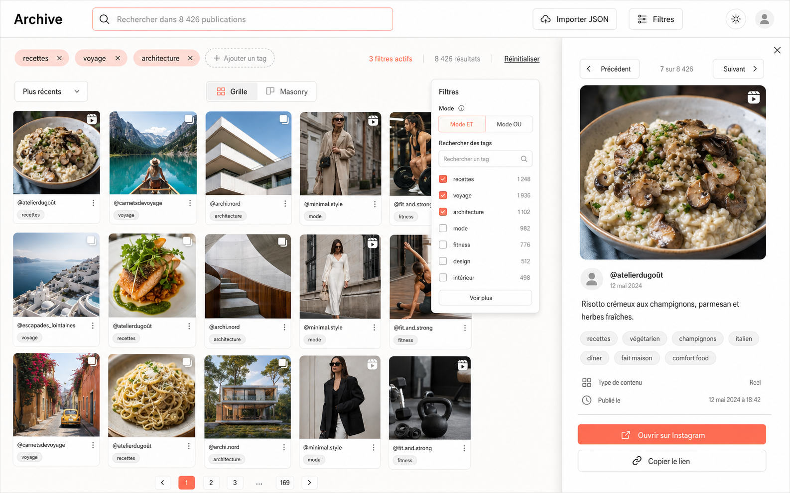
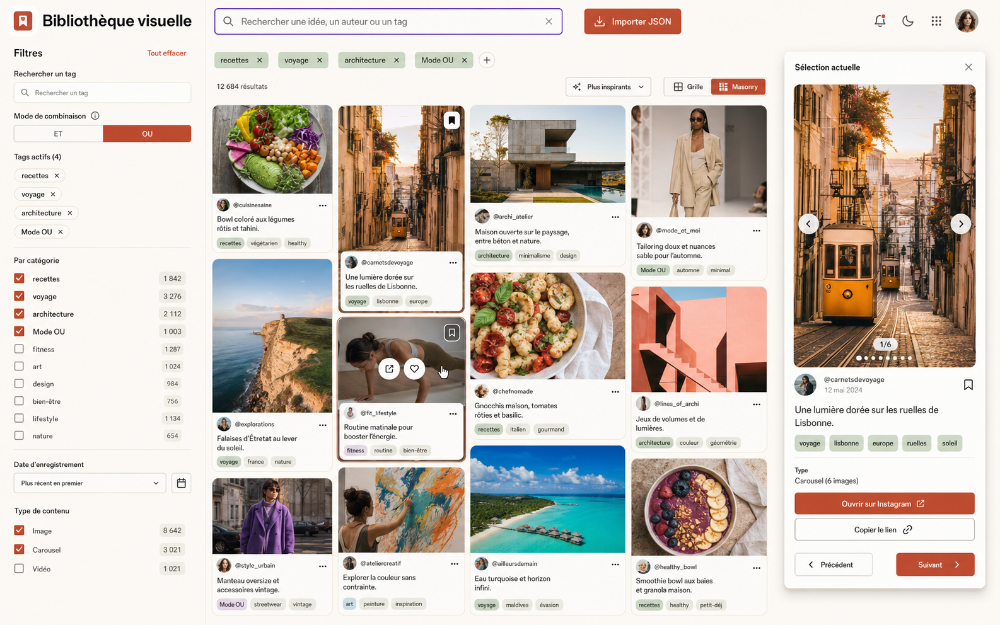
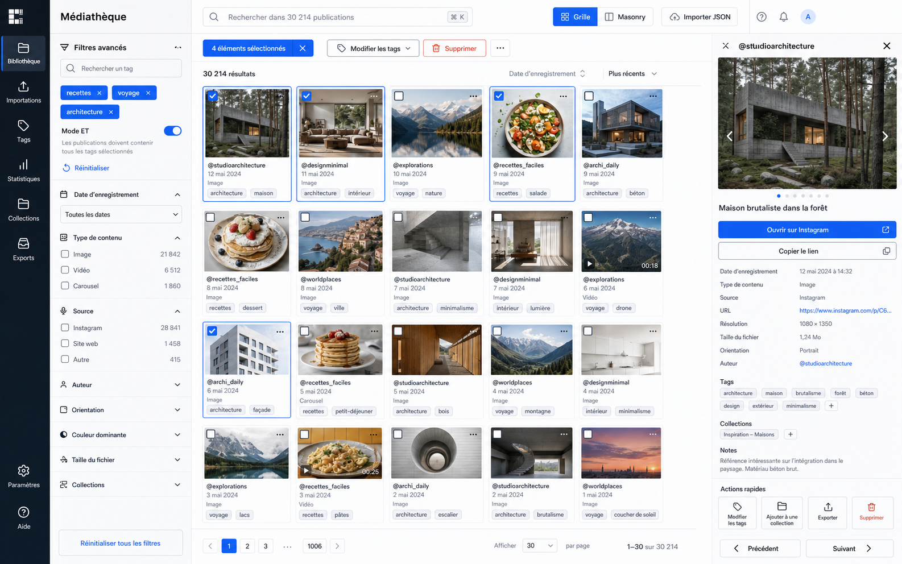
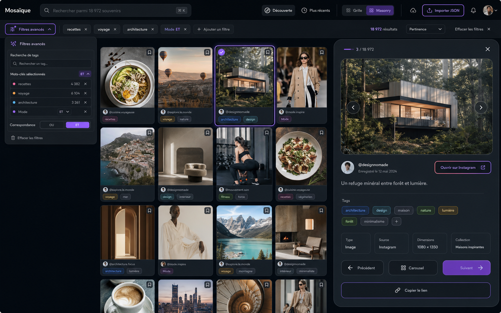

# UI concept phase

These four desktop concepts were generated with the built-in ImageGen tool in
`ui-mockup` mode. They are design references only: no production UI should be
implemented until one direction is explicitly selected.

## Shared UX findings

- Keep search dominant, debounced, keyboard accessible, and reflected in the URL.
- Keep active tags visible and individually removable.
- Move full filters into a drawer or bottom sheet on mobile.
- Preserve filters, sorting, view mode, and position when switching grid modes.
- Preserve the filtered ordering for previous/next navigation in post details.
- Keep JSON import visible without competing with search.
- Reserve image ratios, provide fallbacks, and keep grid responses lightweight.
- Use multi-selection primarily in the professional library direction.

## A — Archive / Instagram minimal



Regular five-column gallery, minimal chrome, and an Instagram-like desktop detail
panel. It is the clearest and calmest direction for personal browsing, but less
suited to bulk operations and advanced tag administration.

**Strengths:** immediate hierarchy, maximum thumbnail emphasis, low visual load,
familiar detail flow. **Limits:** advanced filters are less prominent, metadata
and bulk actions are secondary.

**Mobile:** compact search/action header, two-column grid, full-screen filter
drawer, full-screen detail, sticky detail actions.

### Final ImageGen prompt

```text
Use case: ui-mockup
Asset type: maquette desktop haute définition 16:9 d’une application web personnelle de bibliothèque de posts Instagram sauvegardés
Primary request: Proposition A — Instagram minimaliste. Créer une interface produit réaliste, élégante, épurée et techniquement plausible, inspirée de l’efficacité d’Instagram sans copier sa marque. Priorité absolue aux thumbnails dans une grille régulière de cinq colonnes, navigation compacte, peu de bordures, interactions discrètes, beaucoup d’espace blanc. Montrer simultanément la bibliothèque et un aperçu de détail ouvert sur la droite comme un large panneau, avec média, auteur, caption, tags, lien Instagram et navigation précédent/suivant.
Scene/backdrop: capture d’écran complète d’une application desktop 1440×900, thème clair, fond blanc cassé
Subject: header compact avec nom d’application original “Archive”, barre de recherche très visible; rangée de tags actifs; commandes; grille régulière de cartes photo de cuisine, voyage, architecture, mode et fitness; panneau de détail sur la droite
Style/medium: realistic shippable product UI mockup, haute fidélité, design system cohérent, sans perspective, sans cadre d’ordinateur, typographie sans-serif nette
Composition/framing: vue frontale plein écran 16:9. Header en haut. Sous le header, afficher les tags actifs puis une barre de commandes. Grille régulière principale à gauche sur environ 68% de largeur. Panneau de détail ouvert à droite sur environ 32%. Montrer au moins 12 cartes/thumbnails carrés. Les éléments ne doivent pas se chevaucher.
Color palette: blanc cassé, noir doux, gris neutres, accent corail discret uniquement pour les états actifs
Text (verbatim): tous les textes visibles doivent être exactement en français et lisibles. Inclure clairement “Rechercher dans 8 426 publications”, “recettes”, “voyage”, “architecture”, “3 filtres actifs”, “8 426 résultats”, “Réinitialiser”, “Plus récents”, “Grille”, “Masonry”, “Importer JSON”, “Filtres”, “Mode ET”, “@atelierdugoût”, “Risotto crémeux aux champignons, parmesan et herbes fraîches.”, “Ouvrir sur Instagram”, “Copier le lien”, “Précédent”, “Suivant”.
Key UI elements: cartes avec thumbnails variés et soignés; username sous chaque carte; quelques badges tags; légère indication du type reel ou carousel; recherche; tags actifs supprimables; bouton filtres; nombre de résultats; tri; sélecteur segmenté Grille/Masonry avec Grille actif; bouton Importer JSON avec icône upload; un petit panneau ou popover de filtres visible indiquant Mode ET/OU et une recherche de tags; aperçu de détail avec grande image, caption complète, tous les tags, date, type de contenu, bouton fermer et flèches précédent/suivant.
Accessibility: contrastes WCAG lisibles, zones cliquables confortables, focus visible subtil sur la recherche, labels explicites, hiérarchie claire.
Constraints: rendu desktop HD net, interface uniquement en français, texte lisible, aucune marque ou logo Instagram officiel, aucune faute apparente, aucune vue mobile, aucun watermark, pas de concept art, pas de perspective 3D, pas d’éléments décoratifs inutiles, pas de menu latéral permanent. Tous les composants demandés doivent être visibles dans une seule image.
```

## B — Bibliothèque visuelle / Pinterest editorial



Warm masonry discovery experience with partial captions, visible tags, permanent
filters, and a floating detail panel. It best supports rediscovery, though masonry
requires careful virtualization and scroll restoration.

**Strengths:** rich discovery, varied media formats, contextual cards, always-on
filters. **Limits:** higher visual density, less predictable scan order, weaker
bulk workflows.

**Mobile:** two-column masonry (one on very small screens), filter bottom sheet,
two-line captions, full-screen swipeable detail, compact sort/view controls.

### Final ImageGen prompt

```text
Use case: ui-mockup
Asset type: maquette desktop haute définition 16:9 d’une application web de bibliothèque visuelle de posts sauvegardés
Primary request: Proposition B — Pinterest éditorial. Créer une direction visuelle complète, riche et orientée découverte, réellement différente d’une grille Instagram. Utiliser une grille masonry centrale avec cartes de hauteurs très variées, captions partielles, tags bien visibles, une sidebar permanente de filtres à gauche et un aperçu de détail sous forme de panneau flottant superposé à droite. L’interface doit évoquer un magazine contemporain et la curiosité, tout en restant une application de gestion réaliste.
Scene/backdrop: capture d’écran complète desktop 1440×900 en thème clair chaud, fond ivoire subtil
Subject: sidebar gauche de filtres riches; header éditorial avec recherche; grille masonry de photos variées (recettes, voyages, architecture, mode, fitness, art); panneau détail flottant à droite avec image verticale, auteur, caption, tags et actions
Style/medium: realistic shippable product UI mockup, haute fidélité, sans perspective ni ordinateur, esthétique éditoriale Pinterest moderne, cartes souples aux hauteurs variables, typographie sans-serif nette avec titres éditoriaux affirmés
Composition/framing: vue frontale plein écran 16:9. Sidebar fixe environ 260 px à gauche. Zone principale masonry occupant le centre. Panneau détail ouvert environ 370 px à droite, avec ombre douce. Montrer au moins 12 cartes de hauteurs différentes et plusieurs colonnes. Header horizontal compact au-dessus de la zone principale.
Color palette: ivoire chaud, encre sombre, terracotta, sauge, accents prune discrets, thumbnails très colorés
Text (verbatim): tous les textes visibles doivent être exactement en français et lisibles. Inclure clairement “Bibliothèque visuelle”, “Rechercher une idée, un auteur ou un tag”, “Explorer”, “Filtres”, “Rechercher un tag”, “recettes”, “voyage”, “architecture”, “Mode OU”, “12 684 résultats”, “Tout effacer”, “Plus inspirants”, “Grille”, “Masonry”, “Importer JSON”, “Sélection actuelle”, “@carnetsdevoyage”, “Une lumière dorée sur les ruelles de Lisbonne.”, “Ouvrir sur Instagram”, “Copier le lien”, “Précédent”, “Suivant”.
Key UI elements: thumbnails de tailles variées; cartes avec username, caption sur deux lignes et 2–3 badges tags; états hover visibles sur une carte; recherche; tags actifs supprimables; sidebar avec cases tags et compteurs, choix ET/OU et recherche de tags; résultats; tri; sélecteur segmenté Grille/Masonry avec Masonry actif; bouton Importer JSON très visible avec icône; aperçu détail avec média, caption complète, tous les tags, date, type carousel, fermer, précédent/suivant.
Accessibility: contrastes solides, focus visible sur la recherche, libellés explicites, boutons grands, densité maîtrisée.
Constraints: interface uniquement en français, texte lisible, aucune marque ou logo officiel, aucun watermark, aucune vue mobile, pas de concept art, pas de perspective 3D, pas de grille régulière uniforme, pas d’apparence Instagram minimaliste, ne pas omettre la sidebar de filtres ni le panneau de détail. Tous les composants demandés doivent être visibles dans une seule image.
```

## C — Médiathèque / Professional library



A dense digital asset management tool with structured navigation, permanent
advanced filters, multi-selection, bulk actions, and a metadata inspector. It is
the strongest direction for tens of thousands of posts and tag administration.

**Strengths:** efficiency at scale, clear metadata, bulk operations, extensible
navigation. **Limits:** colder learning curve, less room per thumbnail, many
controls to adapt on small screens.

**Mobile:** bottom navigation, full-screen filters, long-press selection, sticky
bulk bar, collapsible full-page inspector, two-column compact grid.

### Final ImageGen prompt

```text
Use case: ui-mockup
Asset type: maquette desktop haute définition 16:9 d’une application web professionnelle de gestion d’une grande bibliothèque de posts sauvegardés
Primary request: Proposition C — Bibliothèque professionnelle. Créer une interface complète proche d’un outil de gestion de ressources numériques, fortement orientée efficacité pour 30 000 publications. Elle doit être réellement différente des propositions sociales: navigation latérale structurée, barre d’outils dense, filtres puissants, sélection multiple, actions rapides, excellente lisibilité. La zone centrale montre une grille compacte de cartes à ratio régulier avec métadonnées. Un inspecteur de détail est ouvert à droite.
Scene/backdrop: capture d’écran complète desktop 1440×900, thème clair professionnel, fond gris très pâle
Subject: rail/navigation verticale sombre très étroite puis panneau de filtres; barre de recherche globale et outils; grille dense de ressources visuelles; bandeau de sélection multiple; inspecteur détaillé à droite avec aperçu média, métadonnées et actions
Style/medium: realistic shippable SaaS product UI mockup, haute fidélité, style outil professionnel de digital asset management, sans perspective, typographie compacte très lisible, icônes cohérentes
Composition/framing: vue frontale plein écran 16:9. Navigation rail 64 px; colonne filtres 250 px; contenu central environ 760 px; inspecteur de détail 360 px à droite. Montrer au moins 15 cartes compactes avec cases à cocher, certaines sélectionnées. Aucun grand espace inutile.
Color palette: ardoise foncée, blanc froid, gris bleutés, accent bleu électrique accessible, vert succès discret
Text (verbatim): tous les textes visibles doivent être exactement en français et lisibles. Inclure clairement “Médiathèque”, “Rechercher dans 30 214 publications”, “Bibliothèque”, “Importations”, “Tags”, “Filtres avancés”, “Rechercher un tag”, “recettes”, “voyage”, “architecture”, “Mode ET”, “30 214 résultats”, “Réinitialiser”, “Date d’enregistrement”, “Type de contenu”, “Plus récents”, “Grille”, “Masonry”, “Importer JSON”, “4 éléments sélectionnés”, “Modifier les tags”, “Supprimer”, “@studioarchitecture”, “Maison brutaliste dans la forêt”, “Ouvrir sur Instagram”, “Copier le lien”, “Précédent”, “Suivant”.
Key UI elements: recherche globale; chips de tags actifs; colonne filtres avec compteurs et logique ET/OU; résultats; tri; sélecteur Grille/Masonry avec Grille actif; bouton Importer JSON; cartes avec thumbnails, username, date, type, tags et case de sélection; barre d’actions groupées visible; actions rapides sur cartes; aperçu détail avec grande image, caption, tous les tags, dates, type carousel, métadonnées, bouton fermer, navigation précédent/suivant.
Accessibility: contrastes WCAG élevés, focus bleu visible, tailles cliquables suffisantes, labels et icônes explicites, sélection non communiquée uniquement par couleur.
Constraints: interface uniquement en français, texte lisible, aucune marque officielle, aucun watermark, aucune vue mobile, pas de concept art, pas de perspective, ne pas ressembler à Pinterest éditorial ni à Instagram minimaliste, densité professionnelle maîtrisée, tous les composants demandés visibles dans une seule image.
```

## D — Mosaïque / Premium hybrid



Distinctive dark masonry experience combining simple filter chips, advanced
filters on demand, and a large premium detail drawer. It offers the best balance
between discovery and power, at the cost of a more demanding design system.

**Strengths:** strong identity, good use of width, layered filter complexity,
rich in-context detail. **Limits:** highest implementation effort, contrast and
effects require care, more responsive refinement.

**Mobile:** two-level expandable header, horizontally scrollable tag ribbon,
two-column masonry, filter bottom sheet, full-screen detail, sticky actions.

### Final ImageGen prompt

```text
Use case: ui-mockup
Asset type: maquette desktop haute définition 16:9 d’une application web premium de bibliothèque visuelle de posts sauvegardés
Primary request: Proposition D — Hybride premium. Créer une direction distinctive combinant l’élégance minimaliste, la découverte par grille masonry et la puissance de filtrage professionnelle. Design plus premium, micro-interactions modernes suggérées, excellente utilisation de l’espace. Ne pas reproduire les trois autres compositions: utiliser un header panoramique sombre translucide, une barre de filtres horizontale en ruban, une grille masonry raffinée au centre et un aperçu détail en grand drawer bas/latéral qui semble glisser depuis le coin inférieur droit, tout en gardant tous les contrôles visibles.
Scene/backdrop: capture d’écran complète desktop 1440×900, thème sombre premium, fond anthracite profond avec surfaces légèrement translucides
Subject: header premium; recherche large; ruban de filtres intelligents; grille masonry sophistiquée d’images de cuisine, voyage, architecture, mode, fitness et design; drawer de détail flottant à droite avec média, auteur, caption, tags, navigation et boutons
Style/medium: realistic shippable product UI mockup, haute fidélité, premium contemporain, verre dépoli très subtil, ombres délicates, gradients contrôlés, typographie sans-serif raffinée, sans perspective ni cadre matériel
Composition/framing: vue frontale plein écran 16:9. Header sombre environ 78 px. Ruban de tags et commandes juste dessous. Grille masonry principale sur 70% de largeur, avec 4 colonnes et cartes aux rayons généreux. Drawer détail flottant sur 30% à droite avec coins très arrondis et hiérarchie forte. Montrer au moins 12 cartes. Inclure un popover compact de filtres avancés ouvert sous le ruban.
Color palette: anthracite, graphite, blanc chaud, accent violet électrique et pêche, halos très discrets; contraste accessible
Text (verbatim): tous les textes visibles doivent être exactement en français et lisibles. Inclure clairement “Mosaïque”, “Rechercher parmi 18 972 souvenirs”, “recettes”, “voyage”, “architecture”, “Mode ET”, “Filtres avancés”, “18 972 résultats”, “Effacer les filtres”, “Découverte”, “Plus récents”, “Grille”, “Masonry”, “Importer JSON”, “@designnomade”, “Un refuge minéral entre forêt et lumière.”, “Ouvrir sur Instagram”, “Copier le lien”, “Précédent”, “Suivant”, “Carousel”, “Enregistré le 12 mai 2024”.
Key UI elements: thumbnails très variés; cartes masonry avec légende au hover, username et tags; une carte sélectionnée avec halo; recherche; chips actives supprimables; popover filtres avec recherche de tags, compteurs et choix ET/OU; nombre de résultats; tri; sélecteur Grille/Masonry avec Masonry actif; bouton Importer JSON premium avec icône; aperçu détail avec grande image, caption complète, tous les tags, date, type, bouton fermer, navigation précédent/suivant; petit indicateur de progression ou collection discret.
Accessibility: contraste WCAG AA, focus violet net, textes jamais gris trop faible, boutons et icônes labellisés, états actifs à la fois par couleur et forme.
Constraints: interface uniquement en français, texte lisible, aucune marque ni logo officiel, aucun watermark, aucune vue mobile, pas de concept art, pas de perspective 3D, pas d’excès de néon, pas de surcharge glassmorphism, ne pas ressembler à une simple grille sociale ou à un dashboard administratif froid. Tous les composants demandés doivent être visibles dans une seule image.
```
